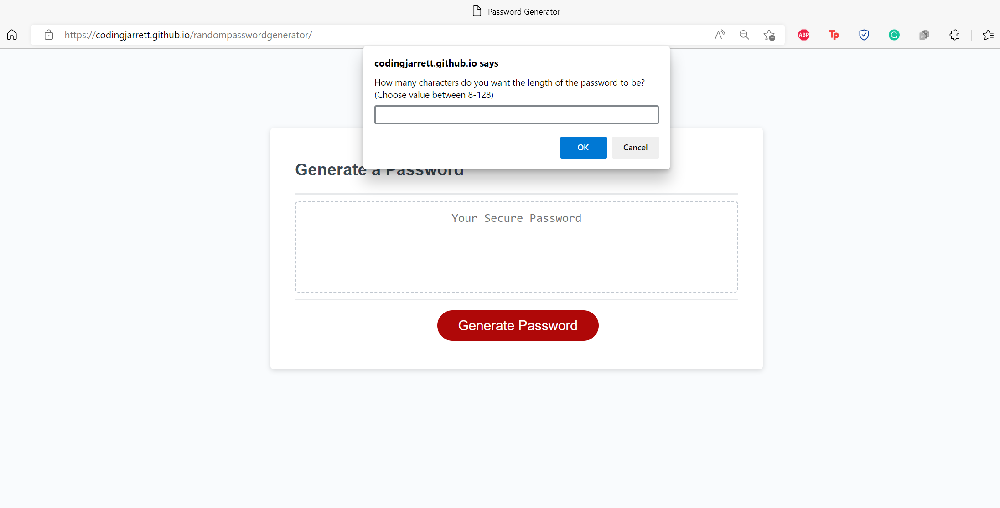
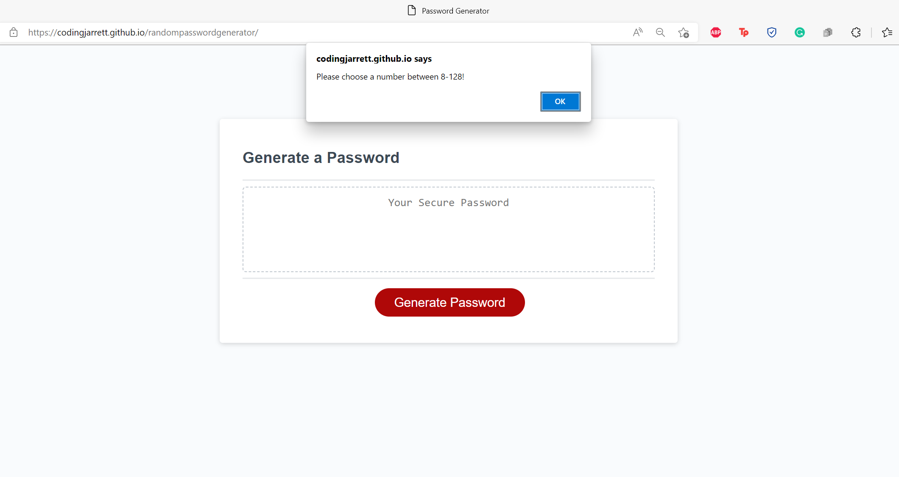
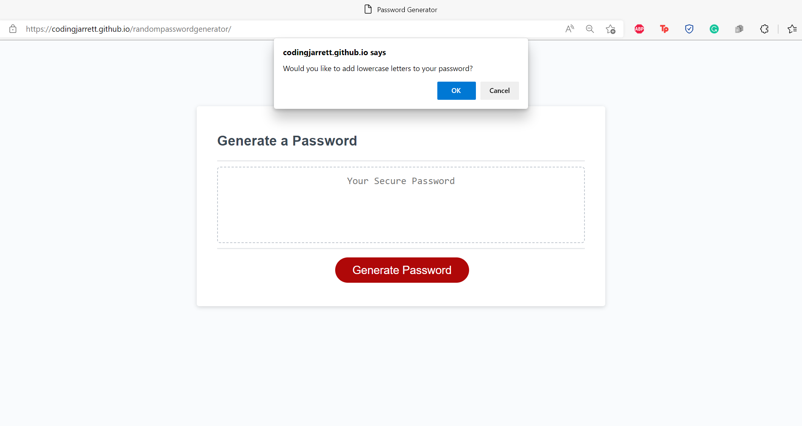
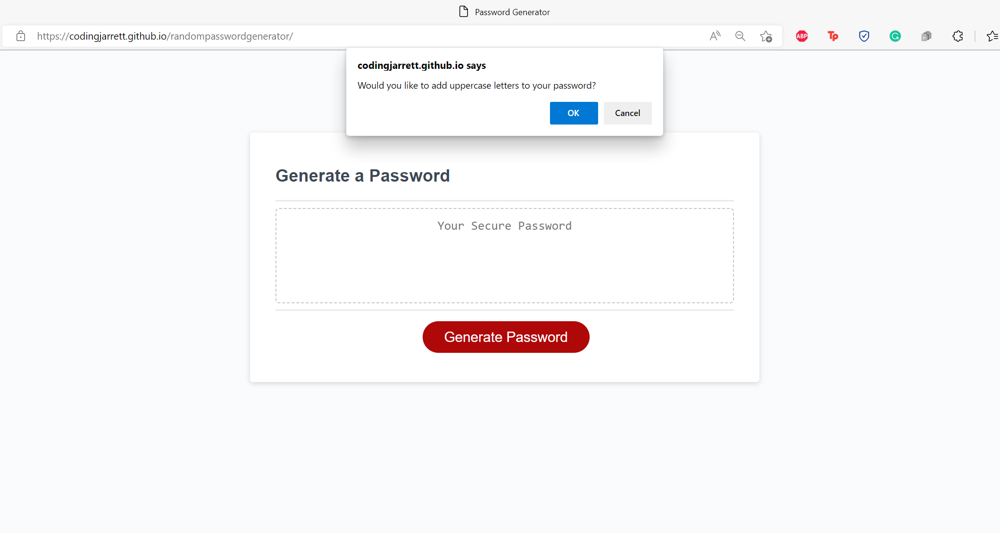
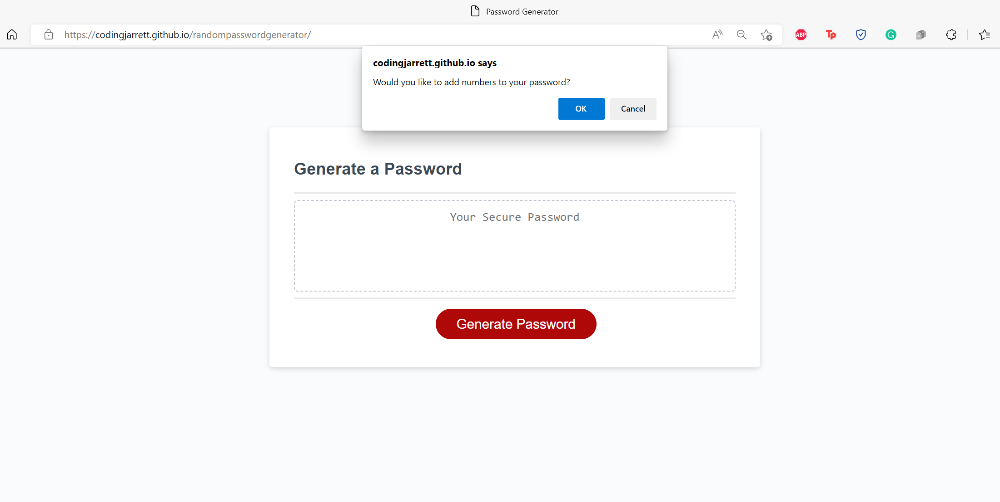
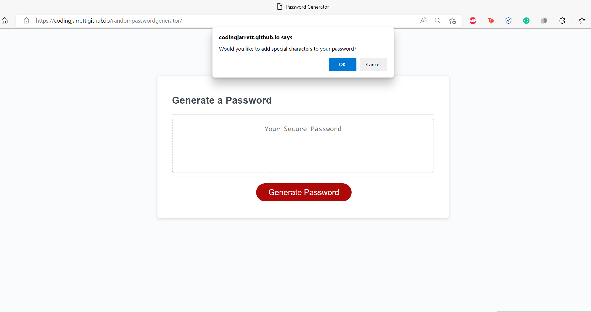
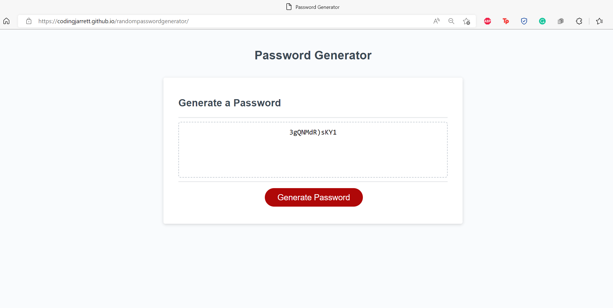

# randompasswordgenerator
This is the repository for the third bootcamp challenge (Password Generator).
## Description
This project entailed adding JavaScript so that an already existing random password generator could operate.

## Usage:
When I click the button to generate a password, then I am presented with a series of prompts for password criteria. When prompted for password criteria, then I select which criteria to include in the password. When prompted for the length of the password, then I choose a length of at least 8 characters and no more than 128 characters. When asked for character types to include in the password, then I confirm whether or not to include lowercase, uppercase, numeric, and/or special characters. When I answer each prompt, then my input should be validated and at least one character type is selected. When all prompts are answered, then a password is generated that matches the selected criteria. When the password is generated, then the password is displayed to the page.

### Desktop Screen

### Alert Popup

### Prompts
 

 

### PW Generated

## Link to deployed webpage: 
https://codingjarrett.github.io/randompasswordgenerator/

## License
Please refer to the GitHub Repository for licensing information. Link to GitHub repository: https://github.com/codingjarrett/radompasswordgenerator.
